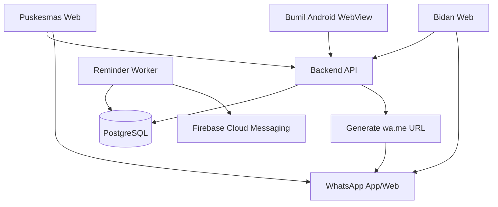

# System Architecture

> **Project:** Sistem Pengingat ANC Ibu Hamil  
> **Document ID:** DOC-ARCH  
> **Version:** 1.0.0  
> **Status:** Review  
> **Owner:** Software Architect  
> **Last Updated:** 2026-08-12  
> **Depends On:** DOC-SRS, DOC-API, DOC-ERD

## 1. Architecture Summary

Server-driven thin-client architecture. Responsive Web and Android WebView render server DTOs. NestJS modular monolith owns domain logic. PostgreSQL is source of truth and also supports transactional outbox/job scheduling for MVP. FCM is the only automatic external notification channel. WhatsApp fallback is a manual human action via `wa.me`.

## 2. Context Diagram

## 3. Containers and Deployment Units

| Unit | Responsibility |
|---|---|
| `web` | Next.js responsive UI; no authoritative domain rules |
| `android-shell` | WebView/Capacitor, secure session bridge, FCM token handling, trusted navigation |
| `api` | Auth, authorization, registry, ANC, visit, reminder, program, dashboard |
| `worker` | Scheduler, push attempt retry, escalation jobs |
| `postgres` | Domain data, outbox/jobs, audit |
| FCM | External push transport |
| WhatsApp | User-operated external app reached by `wa.me` |

## 4. Module Boundaries

`Auth`, `Authorization`, `Registry`, `Pregnancy`, `ANCPlan`, `VisitTracking`, `Reminder`, `ProgramAssessment`, `DashboardReadModel`, `Content`, `Audit`.

No module may directly mutate another module's tables outside defined service/transaction boundary.

## 5. Trust Boundaries

- Internet → Web/API.
- Android WebView → backend.
- Backend → PostgreSQL.
- Worker → FCM.
- Backend generated URL → external WhatsApp.
- `wa.me` URL query is considered potentially exposed through browser/history; minimize content.

## 6. Core Data Flows

### 6.1 Register Bumil
Puskesmas UI → API validation/authz → DB transaction mother+pregnancy+consent+milestones+credential hash → response shows one-time code.

### 6.2 Server-driven Dashboard
Client → role endpoint → authz/scope → domain/read model query → minimal DTO → render.

### 6.3 Reminder Cycle
Worker claims eligible milestone → transaction creates logical cycle → active device? → FCM push attempts → success or terminal/no-device → create WA fallback action.

### 6.4 Manual `wa.me`
Staff requests link by fallback action ID → API checks role/scope/state → server renders minimal approved message + normalized phone → returns URL → client opens WhatsApp → optional link-open telemetry → staff may resolve/unreachable manually. No provider callback exists.

### 6.5 Visit Confirmation
Bidan/Puskesmas → confirm endpoint → authz + assignment + milestone code + facility/date/state rule → transaction locks and sets visit confirmed + append-only history → audit. Server read models immediately derive the confirmed milestone as not reminder-eligible. The reminder worker's atomic pending-action/outbox suppression boundary is completed separately by `TASK-P4-014` so confirmation-vs-send races remain explicit and testable.

### 6.6 K1–K6 Detail Validation
Puskesmas only → detail endpoint → schema validation → store sensitive record → validate → trigger program reassessment event.

## 7. Sync vs Async

Synchronous: auth, CRUD, confirm, detail, dashboard, WA-link generation.  
Async: due scheduling, FCM retries, fallback escalation, program reassessment optional event, non-critical analytics.

## 8. Transaction Boundaries

Critical transaction examples:
- confirmation + reminder suppression + audit/outbox;
- pregnancy close + future reminder cancellation;
- fallback creation idempotency;
- program assessment write with rule version snapshot.

## 9. Job/Retry Model

Use DB-backed lease/queue/outbox. Retry push only for retryable errors. Proposed max 3 attempts, configurable. Dead-letter or terminal state for unexpected worker failure. WA fallback is not a send job; it is an operational action.

## 10. Cache Strategy

Avoid Redis in MVP. HTTP/static asset caching okay. Sensitive dashboard responses should use conservative/no-store policy. No client cache may become authoritative.

## 11. Reliability & Graceful Degradation

- API down: Web/WebView show server unavailable + retry; no offline mutation.
- FCM down: push attempts retry then fallback action.
- WhatsApp unavailable on device: browser fallback may open; staff can mark unreachable.
- DB down: readiness false; no partial local state.
- Worker down: backlog alert; jobs resume from durable DB.

## 12. Observability

Metrics: API latency/error, auth failures, DB pool, scheduler lag, due cycle count, push retry/terminal rate, WA fallback backlog/age, unresolved/unreachable count, confirmation-to-suppression race errors.

Never create metric “WhatsApp delivered” for `wa.me`.

## 13. Deployment Topology

`web`, `api`, `worker` can run as separate containers/processes against one PostgreSQL. Android shell distributed separately and loads trusted HTTPS origin. TLS mandatory.

## 14. Technology Decisions

Next.js/TypeScript + NestJS + PostgreSQL + Capacitor/WebView + FCM are `PROPOSED implementation choices`; server-driven behavior and manual `wa.me` fallback are `CONFIRMED architecture constraints`.

## 15. Scaling Triggers

Revisit worker separation/queue tech when scheduler lag >15 min at normal load, DB queue contention materially affects API p95, or independent team ownership appears. Revisit microservices only with measured need.

## 16. Build vs Buy

Auth for small staff set can be application-managed with secure standard libraries; FCM is external provider; WhatsApp send integration deliberately not bought for MVP.

## 17. Critical Architecture Invariants

1. No K/trimester/facility/program rule duplicated as authoritative client logic.
2. No `wa.me` provider delivery semantics.
3. Puskesmas permission superset of Bidan.
4. Confirmation suppression is atomic.
5. Sensitive details K1–K6 never sent to Bidan/Bumil unless specifically approved summary.
