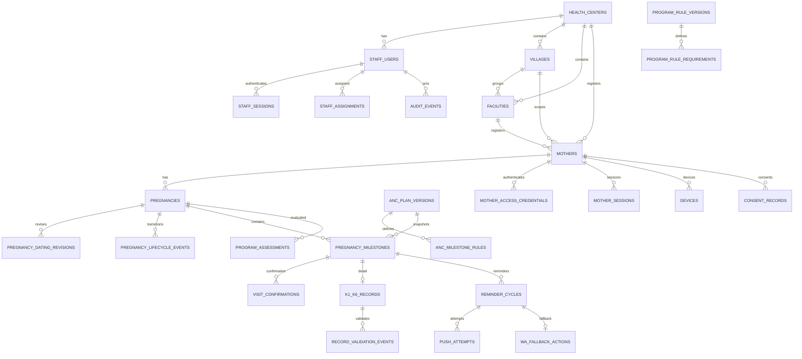

# Entity Relationship & Data Dictionary

> **Project:** Sistem Pengingat ANC Ibu Hamil  
> **Document ID:** DOC-ERD  
> **Version:** 1.1.0  
> **Status:** Review  
> **Owner:** Data Architect  
> **Last Updated:** 2026-08-10  
> **Depends On:** DOC-SRS, DOC-PERMISSION

## 1. ERD

## 2. Entity Dictionary

### `health_centers`
Puskesmas organization/facility scope.
- `id uuid PK`
- `code text unique`
- `name text`
- `status enum(ACTIVE,INACTIVE)`
- `created_at timestamptz`, `updated_at timestamptz`

### `staff_users`
- `id uuid PK`
- `health_center_id uuid FK`
- `role enum(BIDAN,PUSKESMAS,SUPER_ADMIN)`
- `login_identifier text unique`
- `display_name text`
- `password_hash text`
- `failed_login_attempts int`, `locked_until timestamptz nullable`
- `last_login_at timestamptz nullable`
- `status enum(ACTIVE,DISABLED,LOCKED)`
- `created_at`, `updated_at`

### `staff_sessions`
Revocable server-side staff session. Raw access/refresh tokens are never persisted.
- `id uuid PK`
- `staff_user_id uuid FK`
- `access_token_hash text unique`, `refresh_token_hash text unique`
- `access_expires_at`, `refresh_expires_at`
- `rotated_at`, `last_used_at` nullable
- `revoked_at`, `revoked_by_staff_id`, `revocation_reason` nullable as one lifecycle pair
- `created_at`, `updated_at`

### `staff_assignments`
Bidan area/mother assignment.
- `id uuid PK`
- `staff_user_id uuid FK`
- `scope_type enum(AREA,MOTHER)`
- `scope_id uuid`
- `assigned_by uuid FK nullable`
- `revoked_at`, `revoked_by`, `revocation_reason` nullable as one lifecycle group
- unique active assignment key as applicable

### `villages`
- `id uuid PK`
- `health_center_id uuid FK`
- `code text`, `name text`, `status enum(ACTIVE,INACTIVE)`
- unique `(health_center_id, code)` and `(id, health_center_id)`

### `facilities`
- `id uuid PK`
- `health_center_id uuid FK`
- `village_id uuid nullable`
- `code text`, `name text`
- `facility_type enum(PUSKESMAS,POSYANDU,PONED,HOSPITAL,MIDWIFE_PRACTICE,OTHER)`
- `status enum(ACTIVE,INACTIVE)`
- composite FK `(village_id, health_center_id)` prevents a cross-center village link

### `mothers`
- `id uuid PK`
- `health_center_id uuid FK`
- `village_id uuid nullable`
- `registration_facility_id uuid nullable`
- `full_name text NOT NULL`
- `nik_ciphertext text NOT NULL` — Restricted; encrypted/protected at rest according to deployment controls
- `address text NOT NULL`
- `phone_normalized text NOT NULL` — mutable contact value; never PK
- `created_at`, `updated_at`

### `pregnancies`
- `id uuid PK`
- `mother_id uuid FK`
- `health_center_id uuid FK`
- `dating_basis enum(PREGNANCY_START_DATE,HPHT,CLINICALLY_CONFIRMED_DATE,OTHER_APPROVED)`
- `dating_date date NOT NULL` — registration field label: **Awal Kehamilan**; current approved dating input
- `estimated_due_date date nullable`
- `status enum(ACTIVE,CLOSED)`
- `care_plan_version_id uuid FK`
- `created_at`, `updated_at`, `closed_at nullable`

Constraint: at most one active pregnancy per mother (`ASSUMED`, partial unique index).

Composite foreign key `(mother_id, health_center_id)` guarantees that a pregnancy cannot cross the mother's
Puskesmas boundary.

Registration constraints:
- `mothers.full_name`, `mothers.nik_ciphertext`, `mothers.address`, `mothers.phone_normalized`, and `pregnancies.dating_date` are required for new registration.
- NIK is never used as internal PK. If duplicate detection by NIK is later required, use a protected deterministic lookup fingerprint separate from ciphertext and document privacy review before enabling it.

### `pregnancy_dating_revisions`
Append-only approved dating-input history.
- `id uuid PK`
- `pregnancy_id uuid FK`
- `actor_staff_id uuid FK`
- `previous_dating_basis`, `previous_dating_date`
- `revised_dating_basis`, `revised_dating_date`
- `reason text`, `revised_at timestamptz`
- check that basis or date actually changed

### `pregnancy_lifecycle_events`
Append-only lifecycle snapshots used for audit and exact idempotency replay.
- `id uuid PK`
- `pregnancy_id uuid FK`
- `actor_staff_id uuid FK`
- `action text(CREATED,CLOSED)`
- `dating_basis`, `dating_date`, `status`
- `reason nullable`, `occurred_at timestamptz`
- state check requires `CREATED/ACTIVE` without reason or `CLOSED/CLOSED` with reason

### `anc_plan_versions`
- `id uuid PK`
- `version_no int`
- `status enum(DRAFT,APPROVED,ACTIVE,ARCHIVED)`
- `effective_from date`
- `approved_by uuid nullable`
- `approved_at timestamptz nullable`
- immutable after `ACTIVE`

### `anc_milestone_rules`
- `id uuid PK`
- `plan_version_id uuid FK`
- `code enum(K1,K2,K3,K4,K5,K6,K7,K8)`
- `trimester_label text`
- `target_week_start int nullable`
- `target_week_end int nullable`
- `milestone_category enum(ANC,DELIVERY)`
- `required_facility_policy enum(PUSKESMAS_REQUIRED,FLEXIBLE,PONED_OR_RS_REQUIRED)`
- `allowed_facility_types jsonb`
- `reminder_enabled boolean`
- `reminder_interval_days int default 3`
- unique `(plan_version_id, code)`

### `pregnancy_milestones`
- `id uuid PK`
- `pregnancy_id uuid FK`
- `rule_id uuid FK`
- `code enum K1..K8`
- `due_at timestamptz nullable`
- `visit_status enum(UPCOMING,DUE,OVERDUE,CONFIRMED,CANCELLED,NOT_APPLICABLE)`
- `record_validation_status enum(NOT_REQUIRED,INCOMPLETE,VALIDATED)`
- `confirmed_at timestamptz nullable`
- `confirmed_by uuid nullable`
- `created_at`, `updated_at`
- unique `(pregnancy_id, code)`

### `visit_confirmations`
Append-only confirmation/correction history.
- `id uuid PK`
- `milestone_id uuid FK`
- `actor_staff_id uuid FK`
- `action enum(CONFIRM,CORRECT)`
- `facility_id uuid nullable`
- `occurred_on date nullable`
- `reason text nullable`
- `created_at`

### `k1_k6_records`
Puskesmas-managed program details only.
- `id uuid PK`
- `milestone_id uuid FK unique`
- `record_payload jsonb` — schema/version controlled; sensitive
- `schema_version text`
- `status enum(INCOMPLETE,VALIDATED)`
- `validated_at timestamptz nullable`
- `validated_by uuid nullable`
- `updated_at`

> 💡 Reasoning: MVP can use versioned JSON payload for program components while rule/component schema is still being clinically finalized. If stable/high-query fields emerge, normalize them in a migration.

### `record_validation_events`
- `id uuid PK`
- `record_id uuid FK`
- `action enum(VALIDATE,REOPEN,CORRECT)`
- `actor_staff_id uuid FK`
- `reason text nullable`
- `created_at`

### `mother_access_credentials`
- `id uuid PK`
- `mother_id uuid FK`
- `code_hash text`
- `status enum(ACTIVE,REVOKED)`
- `issued_at`, `revoked_at nullable`
No plaintext code.

### `mother_sessions`
- `id uuid PK`
- `mother_id uuid FK`
- `session_hash text`
- `expires_at`, `revoked_at nullable`

### `devices`
- `id uuid PK`
- `mother_id uuid FK`
- `platform enum(ANDROID)`
- `push_token_encrypted text`
- `status enum(ACTIVE,INVALID,REVOKED)`
- `last_seen_at`, `updated_at`

### `consent_records`
- `id uuid PK`
- `mother_id uuid FK`
- `purpose enum(REMINDER,DATA_PROCESSING,OTHER)`
- `status enum(GRANTED,WITHDRAWN)`
- `source text`
- `recorded_at`

### `reminder_cycles`
One logical reminder decision per milestone/window.
- `id uuid PK`
- `milestone_id uuid FK`
- `cycle_anchor_at timestamptz`
- `status enum(PENDING,PUSH_ATTEMPTING,PUSH_SUCCEEDED,WA_ACTION_REQUIRED,MANUAL_FOLLOWUP,ESCALATED,CANCELLED)`
- `idempotency_key text unique`
- `created_at`, `closed_at nullable`

Suggested unique logical key `(milestone_id, cycle_anchor_at)`.

### `push_attempts`
- `id uuid PK`
- `reminder_cycle_id uuid FK`
- `attempt_no int`
- `status enum(PENDING,SUCCESS,RETRYABLE_FAILURE,TERMINAL_FAILURE)`
- `provider_message_id text nullable`
- `error_code text nullable`
- `attempted_at`
- unique `(reminder_cycle_id, attempt_no)`

### `wa_fallback_actions`
No provider delivery status.
- `id uuid PK`
- `reminder_cycle_id uuid FK unique`
- `mother_id uuid FK`
- `status enum(READY,LINK_GENERATED,LINK_OPENED,RESOLVED_MANUALLY,UNREACHABLE,SKIPPED,EXPIRED)`
- `template_version_id uuid nullable`
- `link_generated_at`, `link_opened_at`, `resolved_at` nullable
- `resolved_by uuid nullable`
- `manual_note text nullable`
- `escalated_at nullable`

Full `wa.me` URL should generally be generated on demand, not persisted.

### `program_rule_versions`
- `id uuid PK`
- `version_no int`
- `status enum(DRAFT,APPROVED,ACTIVE,ARCHIVED)`
- `approved_by`, `approved_at`, `effective_from`

### `program_rule_requirements`
- `id uuid PK`
- `program_rule_version_id uuid FK`
- `requirement_type enum(MILESTONE_VALIDATED,FIELD_PRESENT,OTHER_APPROVED)`
- `milestone_code enum(K1,K2,K3,K4,K5,K6,K7,K8) nullable`
- `rule_config jsonb`

### `program_assessments`
- `id uuid PK`
- `pregnancy_id uuid FK`
- `rule_version_id uuid FK`
- `sigizi_kesga_recording_status enum(IN_PROGRESS,COMPLETE,NOT_EVALUATED)`
- `fetal_rights_status enum(NOT_YET_MET,MET,NOT_EVALUATED)`
- `evidence_summary jsonb` — identifiers/booleans, no unnecessary raw clinical values
- `evaluated_at`
- `evaluated_by_type enum(SYSTEM,STAFF)`
- `evaluated_by_staff_id uuid nullable`

### `audit_events`
Append-only.
- `id uuid PK`
- `actor_type`, `actor_id`
- `action`
- `resource_type`, `resource_id`
- `metadata jsonb` redacted
- `created_at`

### `api_idempotency_records`
Shared mutation coordination metadata; no request/response body.
- `id uuid PK`
- `actor_key text`, `operation text`, `idempotency_key uuid`
- `request_hash text` — keyed HMAC fingerprint only
- `result_resource_type text`, `result_resource_id uuid`, `completed_at timestamptz` as one completion group
- unique `(actor_key, operation, idempotency_key)`
- `created_at`

## 3. Indexes by Query Pattern

- `pregnancy_milestones (pregnancy_id, code)` unique.
- `pregnancy_milestones (visit_status, due_at)` for scheduler.
- `reminder_cycles (milestone_id, cycle_anchor_at)` + unique idempotency.
- `push_attempts (reminder_cycle_id, status)`.
- `wa_fallback_actions (status, escalated_at)` for Puskesmas queue.
- `staff_assignments (staff_user_id, scope_type, scope_id)`.
- `staff_sessions (access_token_hash, access_expires_at)` and `(refresh_token_hash, refresh_expires_at)` for active-session lookup.
- `villages (health_center_id, status, name)` and `facilities (health_center_id, status, name)`.
- `program_assessments (pregnancy_id, evaluated_at desc)`.
- `api_idempotency_records (actor_key, operation, idempotency_key)` unique.
- `pregnancy_dating_revisions (pregnancy_id, revised_at desc, id desc)`.
- `pregnancy_lifecycle_events (pregnancy_id, occurred_at desc, id desc)`.

## 4. Sensitivity

`k1_k6_records`, pregnancy dating, program evidence, contact, and access data are Restricted. `wa_fallback_actions` should store minimal message metadata, not full sensitive content.

## 5. Retention and Deletion

`TBD` by Privacy/Legal. Do not hard-delete audit/history by default. Mother/pregnancy deletion/anonymization workflow must respect legal/program retention.

## 6. Migration Considerations

This is a breaking redesign from old K1–K6/notification-provider schema. No production legacy dataset is confirmed, so migration document remains skipped. If existing production data appears, create `MIGRATION.md` before schema rollout.
