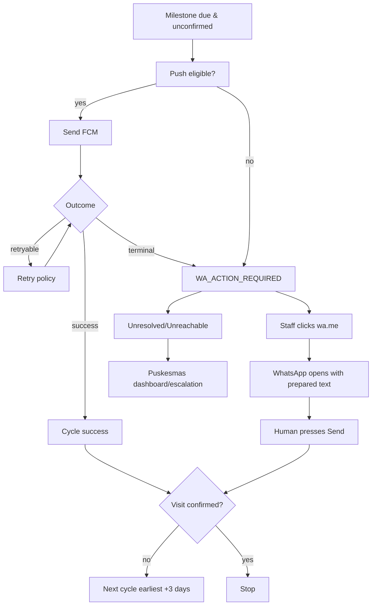

# PRD: Notification Automation

> **Feature ID:** FEAT-NOTIF  
> **Version:** 1.0.0  
> **Status:** Review  
> **Priority:** P0  
> **Owner:** Product Owner  
> **Dependencies:** FEAT-ANC, FEAT-CHECKUP, ADR-006  
> **Last Updated:** 2026-08-08

## 1. Overview

Setiap milestone reminder-eligible yang belum `CONFIRMED` mendapat logical reminder **setiap 3 hari**. Jalur pertama adalah Android push. Push retryable failure dicoba ulang menurut policy. Jika push tidak dapat digunakan atau berakhir terminal failure, sistem membuat **manual WhatsApp fallback action**; petugas membuka server-generated `wa.me` dan menekan Kirim.

## 2. Goals
Reliable reminder loop, no duplicates, operational visibility, gratis/lean WhatsApp fallback tanpa false delivery claims.

## 3. Non-Goals
Tidak ada automatic WhatsApp send, webhook, delivery/read receipt, WhatsApp bot/gateway, atau provider retry pada `wa.me`.

## 4. Actors & Permissions
Worker creates cycles/push attempts. Bidan dapat menindaklanjuti WA action untuk assigned Bumil. Puskesmas dapat menindaklanjuti seluruh scoped Bumil dan melihat aggregate unresolved/escalated.

## 5. Preconditions
Milestone eligible, pregnancy active, consent allows reminder, `visit_status != CONFIRMED`, and no duplicate active cycle.

## 6. User Stories
- `US-NOTIF-001`: Bumil receives push automatically.
- `US-NOTIF-002`: Push fails → staff gets WA action.
- `US-NOTIF-003`: Puskesmas sees unresolved/unreachable reminders.
- `US-NOTIF-004`: Confirmation stops reminders.

## 7. Scheduling Algorithm

1. Determine eligible milestone on server.
2. If already `CONFIRMED/CANCELLED/NOT_APPLICABLE`, stop.
3. If no logical cycle in current 3-day window, create one.
4. If active Android device exists, create push attempt.
5. Retry only retryable push failure under policy.
6. Push success closes this cycle as `PUSH_SUCCEEDED`.
7. Terminal/no-device outcome creates one `WA_ACTION_REQUIRED`.
8. If WA action already unresolved, do not create duplicate.
9. Staff action may become `LINK_OPENED`, `RESOLVED_MANUALLY`, `UNREACHABLE`, or `SKIPPED`.
10. Unresolved/unreachable action becomes visible/escalated to Puskesmas.
11. If visit remains unconfirmed, next logical cycle is eligible no earlier than 3 days after previous cycle anchor/resolution policy.

## 8. Channel Routing

## 9. Status Model

### Reminder Cycle
`PENDING | PUSH_ATTEMPTING | PUSH_SUCCEEDED | WA_ACTION_REQUIRED | MANUAL_FOLLOWUP | ESCALATED | CANCELLED`

### Push Attempt
`PENDING | SUCCESS | RETRYABLE_FAILURE | TERMINAL_FAILURE`

### `wa.me` Action
`READY | LINK_GENERATED | LINK_OPENED | RESOLVED_MANUALLY | UNREACHABLE | SKIPPED | EXPIRED`

**Forbidden derived statuses for `wa.me`:** `SENT`, `DELIVERED`, `READ`, provider `FAILED`.

## 10. Business Rules
- Cadence = 3 days (`CONFIRMED`).
- Push max attempts `PROPOSED=3`, configurable; backoff configurable.
- No duplicate unresolved WA action for same milestone.
- Phone normalized to international digits without `+`, e.g. `0812... → 62812...`.
- Link generated on demand, not stored as full URL if avoidable.
- Message excludes NIK, diagnosis, lab result, risk category.
- Puskesmas visibility is guaranteed for unresolved/escalated actions.
- Opening link is not proof of send.

## 11. Acceptance Criteria
`AC-NOTIF-001`: Given due unconfirmed milestone, one cycle per 3-day window is created.  
`AC-NOTIF-002`: Retryable FCM failure retries up to policy; terminal errors do not loop forever.  
`AC-NOTIF-003`: Terminal/no-device creates WA action exactly once.  
`AC-NOTIF-004`: Server-generated URL uses normalized phone and encoded approved text.  
`AC-NOTIF-005`: UI never says “WhatsApp terkirim” from link open.  
`AC-NOTIF-006`: Unresolved/UNREACHABLE appears on Puskesmas dashboard.  
`AC-NOTIF-007`: Confirming visit cancels/suppresses same-milestone future cycles atomically.  
`AC-NOTIF-008`: Sensitive template fields are rejected.

## 12. UI/UX Specifications
Puskesmas card: Bumil, milestone, push failure summary, fallback age, `[Buka WhatsApp]`, `[Tandai Ditindaklanjuti]`, `[Tidak Dapat Dihubungi]`. Bidan sees only assigned items. Copy uses “Buka WhatsApp”, never “Kirim otomatis”.

## 13. API References
`API-REM-001..008`.

## 14. Data Model References
`reminder_cycles`, `push_attempts`, `wa_fallback_actions`, `devices`, `notification_preferences`.

## 15. Error & Recovery Behavior
Worker crash uses outbox/lease/idempotency. Invalid phone → WA action `UNREACHABLE/NEEDS_CONTACT_FIX` operationally. WebView offline does not change source-of-truth state.

## 16. Security & Privacy
Server controls target and template; client cannot submit arbitrary phone/message. Short-lived/action-bound server endpoint preferred over arbitrary template payload.

## 17. Analytics & Audit Events
`REMINDER_CYCLE_CREATED`, `PUSH_SUCCESS`, `PUSH_TERMINAL_FAILURE`, `WA_ACTION_CREATED`, `WA_LINK_OPENED`, `WA_ACTION_RESOLVED`, `WA_UNREACHABLE`, `REMINDER_ESCALATED`.

## 18. Testing Scenarios
Clock control, duplicate scheduler, push transient/terminal, no device, normalized phone, URL encoding, unauthorized fallback action, sensitive-field rejection, confirmation race.

## 19. Dependencies & Rollout
FCM credentials configured; manual fallback training complete.

## 20. Open Questions
`OPEN-OPS-001`: exact escalation SLA for an unresolved WA action. This can remain configuration during implementation.
