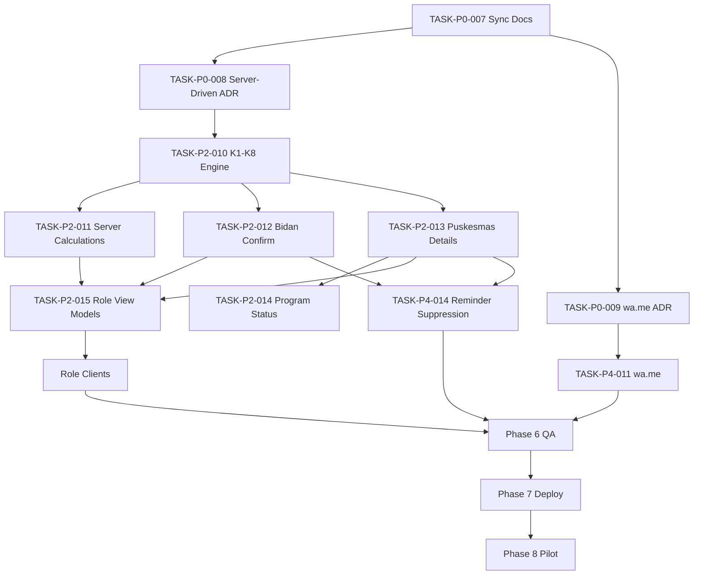

# Implementation Tasks

> **Project:** Sistem Pengingat ANC Ibu Hamil  
> **Document ID:** DOC-TASKS  
> **Version:** 1.1.0  
> **Status:** Review  
> **Owner:** Engineering Lead  
> **Last Updated:** 2026-08-12  
> **Depends On:** DOC-SRS, PRD documents, DOC-PERMISSION, DOC-ERD, DOC-API, DOC-ARCH, DOC-SECURITY, DOC-DSD, DOC-TESTING

## 1. Change Request Context

**Mode:** `CHANGE_REQUEST`  
**Classification:** `MAJOR`

> 💡 Reasoning: Keputusan terbaru mengubah behavior dan contract lintas modul: dua delivery surface (Web + Android WebView), business logic server-driven, WhatsApp MVP menggunakan `wa.me` tanpa WhatsApp API/Gateway, serta pemisahan konfirmasi sederhana Bidan dari pencatatan detail Puskesmas. Perubahan ini breaking terhadap beberapa task lama sehingga versi dokumen dinaikkan dari `0.1.0` ke `1.0.0`.

### 1.1 Confirmed Decisions — `CR-2026-08-08`

- `CONFIRMED` — Produk memiliki dua delivery surface: **Web** dan **Android WebView**.
- `CONFIRMED` — Business rule, perhitungan, authorization, status K, reminder decision, dan generator link WhatsApp berada di **server**; client adalah thin client.
- `CONFIRMED` — WhatsApp MVP menggunakan **`wa.me`**; tidak menggunakan WhatsApp Business API, gateway, bot, atau WA blast otomatis.
- `CONFIRMED` — Membuka `wa.me` tidak boleh dianggap sebagai pesan terkirim.
- `CONFIRMED` — **Bidan hanya mengonfirmasi “Sudah Periksa”**; tidak mengisi detail klinis/pencatatan program.
- `CONFIRMED` — **Puskesmas mengelola detail pencatatan K1–K6** dan validasi akhir.
- `CONFIRMED` — K1, K4, K5 wajib ke Puskesmas sesuai rule proyek.
- `CONFIRMED` — K2, K3, K6, K7 dapat dikonfirmasi sederhana oleh Bidan sesuai kewenangan.
- `CONFIRMED` — K adalah milestone/urutan kunjungan/pemeriksaan, bukan nama trimester.
- `CONFIRMED` — Ibu hamil tidak mengonfirmasi sendiri bahwa pemeriksaan sudah dilakukan.

### 1.2 Authoritative-Document Sync

Sinkronisasi blueprint selesai pada 2026-08-08. `SRS.md`, PRD, `PERMISSION.md`, `ERD.md`, `API.md`, `ARCHITECTURE.md`, `SECURITY.md`, `DSD.md`, `TESTING.md`, `TRACEABILITY.md`, ADR, dan dokumen operasi sekarang memakai model yang sama.

> ⚠️ Risk Flag `RSK-011` — Clinical/program parameter belum production-approved
> - Probability: Medium
> - Impact: Critical
> - Mitigation: rule minggu/komponen wajib tetap versioned configuration dan tidak di-seed sebagai production truth sebelum approval.
> - Trigger: engineer perlu hardcode target klinis yang belum disetujui.
> - Owner: Clinical/Program Owner

## 2. Task Rules

Effort adalah planning aid, bukan komitmen deadline:

- `[XS]` < 1 jam
- `[S]` 1–3 jam
- `[M]` 0.5–1 hari
- `[L]` 1–3 hari
- `[XL]` wajib dipecah atau diberi alasan eksplisit

Setiap task executable wajib memiliki `Owner`, `References`, `Depends on`, dan `Done when`. ID task lama tidak digunakan ulang untuk arti baru.

## 3. Deprecated Task IDs

| Task ID | Status | Alasan | Pengganti |
|---|---|---|---|
| `TASK-P2-005` | `DEPRECATED` | Hanya K1–K6; domain baru memakai milestone K1–K8. | `TASK-P2-010` |
| `TASK-P2-007` | `DEPRECATED` | Completion digabung; sekarang `CONFIRMED` Bidan dipisah dari `VALIDATED` Puskesmas. | `TASK-P2-012`, `TASK-P2-013` |
| `TASK-P3-004` | `DEPRECATED` | UI K1–K6 gabungan tidak sesuai pembagian role. | `TASK-P3-008`, `TASK-P3-009`, `TASK-P3-010` |
| `TASK-P4-003` | `DEPRECATED` | Channel router push-vs-WhatsApp otomatis tidak berlaku untuk `wa.me`. | `TASK-P4-011`, `TASK-P4-012` |
| `TASK-P4-006` | `DEPRECATED` | Official WhatsApp provider dikeluarkan dari MVP. | `TASK-P4-011` |
| `TASK-P4-007` | `DEPRECATED` | WhatsApp webhook/reconciliation tidak ada pada `wa.me`. | `TASK-P4-012` |
| `TASK-P5-001` | `DEPRECATED` | Push failure → WhatsApp otomatis tidak mungkin dengan `wa.me`. | None in MVP |
| `TASK-P5-002` | `DEPRECATED` | Ibu tidak mengajukan klaim “sudah periksa”. | `TASK-P2-012` |

## Phase 0 — Decisions, Repository & Foundations

- [x] `TASK-P0-001` [S] Review ADR-001–ADR-004 terhadap keputusan terbaru dan tandai yang perlu `Superseded`
  - Owner: Architect + Product + Security + Clinical
  - References: `ADR/`, `CR-2026-08-08`
  - Depends on: None
  - Done when: setiap ADR memiliki status eksplisit dan konflik WhatsApp/ANC tercatat.

- [x] `TASK-P0-002` [M] Bootstrap monorepo/workspaces untuk web, API/server, worker, shared contracts, dan Android WebView shell
  - Owner: Engineering Lead
  - References: DOC-ARCH, `CR-2026-08-08`
  - Depends on: TASK-P0-001
  - Done when: clean checkout dapat build/test semua workspace dan client tidak memiliki domain-service implementation.

- [x] `TASK-P0-003` [M] Tambahkan CI untuk lint, type-check, unit/integration test, secret scan, dan dependency scan
  - Owner: DevOps
  - References: DOC-SECURITY, DOC-TESTING
  - Depends on: TASK-P0-002
  - Done when: protected branch menolak perubahan jika check wajib gagal.
  - Evidence: workflow `verify` lulus lokal dan di GitHub Actions; `main` mewajibkan pull request dan strict `verify`, berlaku untuk admin, linear history aktif, serta force-push/penghapusan branch dinonaktifkan.

- [x] `TASK-P0-004` [S] Buat environment validation dan `.env.example`
  - Owner: Backend + DevOps
  - References: DOC-ENV
  - Depends on: TASK-P0-002
  - Done when: server gagal start dengan aman jika config wajib tidak tersedia dan tidak ada secret asli di repository.

- [x] `TASK-P0-005` [M] Siapkan PostgreSQL migration framework dan baseline schema
  - Owner: Backend + Data
  - References: DOC-ERD
  - Depends on: TASK-P0-002
  - Done when: migration berjalan di CI database dan rollback/forward strategy terdokumentasi.
  - Evidence: PostgreSQL 17 local disposable database dan GitHub Actions run `31244315334` lulus `up → down → up`; rollback/forward strategy terdokumentasi.

- [x] `TASK-P0-006` [M] Implement structured logging, correlation ID, redaction, health/readiness endpoint
  - Owner: Backend
  - References: NFR-010, NFR-014, DOC-ARCH
  - Depends on: TASK-P0-002
  - Done when: redaction test dan health/readiness integration test lulus.

- [x] `TASK-P0-007` [L] Sinkronkan authoritative documents dengan `CR-2026-08-08`
  - Owner: Product Owner + Architect
  - References: DOC-PLANNING, DOC-SRS, PRD-ANC, PRD-CHECKUP, PRD-NOTIF, DOC-PERMISSION, DOC-ERD, DOC-API, DOC-ARCH, DOC-TESTING, DOC-TRACE
  - Depends on: TASK-P0-001
  - Done when: Web+WebView, server-driven rules, `wa.me`, Bidan confirm-only, Puskesmas detail K1–K6, K1/K4/K5 rule, K2/K3/K6/K7 confirmation, enums dan endpoint konsisten.

- [x] `TASK-P0-008` [M] Buat ADR **Server-Driven Thin Client + Web/WebView** (`ADR-005`)
  - Owner: Architect
  - References: DOC-ARCH, `CR-2026-08-08`
  - Depends on: TASK-P0-007
  - Done when: ADR mencatat server sebagai source of truth, failure mode, trade-off, dan revisit trigger.

- [x] `TASK-P0-009` [S] Buat ADR **Push retry + manual `wa.me` fallback** (`ADR-006`) dan supersede routing provider lama
  - Owner: Architect + Product
  - References: PRD-NOTIF, ADR-002, ADR-006, `CR-2026-08-08`
  - Depends on: TASK-P0-007
  - Done when: ADR menegaskan tidak ada delivery/read receipt dan sistem tidak boleh mengklaim `SENT`.

## Phase 1 — Data, Auth & Security Baseline

- [x] `TASK-P1-001` [L] Implement staff users, password hashing, login, refresh/session revocation
  - Owner: Backend
  - References: FR-001, PRD-STAFF, API-AUTH-001–005
  - Depends on: TASK-P0-005, TASK-P0-007
  - Done when: auth/session security suite lulus.
  - Evidence: salted scrypt, opaque hashed session credentials, persistent lockout, atomic single-use refresh, logout/revocation, 18 API tests, dan PostgreSQL-backed auth smoke lulus.

- [x] `TASK-P1-002` [M] Implement organization, village, facility, dan staff assignment tables/services
  - Owner: Backend
  - References: FR-003, DOC-ERD
  - Depends on: TASK-P0-005, TASK-P0-007
  - Done when: scoped CRUD integration tests lulus.
  - Evidence: migration, scoped CRUD integration tests, composite same-center FK test, dan real PostgreSQL organization smoke lulus.

- [x] `TASK-P1-003` [L] Implement centralized authorization policy dan scoped repositories di server
  - Owner: Backend + Security
  - References: FR-002, DOC-PERMISSION, `CR-2026-08-08`
  - Depends on: TASK-P1-001, TASK-P1-002
  - Done when: cross-role/cross-area negative tests lulus dan UI hiding bukan satu-satunya kontrol.
  - Evidence: deny-by-default capability policy, server-side mother scope repository, Puskesmas-superset test, Super Admin default denial, Bidan/cross-center negative tests, dan HTTP 403 smoke lulus.

- [x] `TASK-P1-004` [M] Implement append-only audit service dengan safe metadata policy
  - Owner: Backend
  - References: FR-022, NFR-015, DOC-SECURITY
  - Depends on: TASK-P0-005, TASK-P0-006
  - Done when: konfirmasi/validasi dan critical actions memiliki immutable audit event.
  - Evidence: audit service diterapkan pada auth, session, staff, organization, dan assignment security actions; metadata allowlist/redaction test serta PostgreSQL append-only mutation rejection lulus. Domain confirmation/validation akan memakai service ini pada owning task Phase 2.

- [x] `TASK-P1-005` [L] Implement break-glass grant/expiry/audit jika tetap P0 setelah review
  - Owner: Backend + Security
  - References: FR-023, ADR-004
  - Depends on: TASK-P1-003, TASK-P1-004
  - Done when: Super Admin ditolak default dan expiry/audit test lulus, atau feature dipindah Deferred.
  - Evidence: owner decision 2026-08-10 menempatkan break-glass sebagai `Deferred`; Super Admin tetap deny-by-default untuk health data routine.

- [x] `TASK-P1-006` [M] Implement API validation, canonical errors, idempotency, dan concurrency helpers
  - Owner: Backend
  - References: DOC-API
  - Depends on: TASK-P0-005, TASK-P0-007
  - Done when: shared validation/error/idempotency tests lulus.
  - Evidence: strict Zod parsing/canonical field errors, UUID idempotency contract, HMAC request fingerprint, resource-reference-only persistence, advisory-lock + serializable retry coordinator, conflict mapping, unit tests, migration `down → up`, dan concurrent PostgreSQL smoke lulus.

- [x] `TASK-P1-007` [M] Implement Web staff login/session/forbidden states
  - Owner: Frontend
  - References: PRD-STAFF, DOC-DSD
  - Depends on: TASK-P1-001
  - Done when: login/logout/session-expiry/403 E2E lulus.
  - Evidence: same-origin BFF menyimpan access/refresh token hanya di cookie `HttpOnly` + `SameSite=Strict`, mutation origin check aktif, kontrak upstream divalidasi, login failure tetap generik, refresh/logout smoke terhadap API + PostgreSQL nyata lulus, dan login/workspace/forbidden/mobile states lolos QA aksesibilitas.

- [x] `TASK-P1-008` [M] Putuskan dan implement Admin/Super Admin MFA bila requirement tetap dipertahankan
  - Owner: Security + Backend + Frontend
  - References: PRD-STAFF open question
  - Depends on: TASK-P1-001, TASK-P0-007
  - Done when: mekanisme/recovery diterima atau requirement ditandai Deferred dengan owner.
  - Evidence: owner decision 2026-08-10 mempertahankan MFA privileged sebagai `PROPOSED` dan menunda keputusan/implementasi hingga gate pra-produksi; Security + Product menjadi owner keputusan tersebut.

## Phase 2 — P0 Backend / Core Domain

- [x] `TASK-P2-001` [L] Implement mother/contact/consent registry service
  - Owner: Backend
  - References: FR-004, FR-005, FR-018, PRD-REGISTRY
  - Depends on: TASK-P1-003, TASK-P1-004
  - Done when: registrasi mewajibkan nama, NIK, alamat, nomor telepon, dan awal kehamilan; mother+pregnancy dibuat atomik; phone normalization, NIK protection, dan consent tests lulus.
  - Evidence: `API-MOTHER-001` Puskesmas-only memakai strict contract + UUID idempotency, PostgreSQL serializable transaction untuk mother/pregnancy/reminder consent, Indonesian phone normalization, NIK AES-256-GCM ciphertext, response masking/no leakage, audit resource-only, API/cipher regression tests, serta smoke PostgreSQL sintetis di protected CI.

- [x] `TASK-P2-002` [L] Implement pregnancy dan dating revision lifecycle
  - Owner: Backend
  - References: FR-005, FR-024, DOC-ERD
  - Depends on: TASK-P2-001
  - Done when: one-active-pregnancy, revision history, dan close tests lulus.
  - Evidence: migration `000004` menegakkan same-center FK, partial unique active pregnancy, append-only dating revisions/lifecycle snapshots; API Puskesmas-only create/revise/close memakai immutable idempotency replay, audit, scope-safe errors, 29 API tests, 16 database tests, dan synthetic PostgreSQL lifecycle smoke di protected CI. Cancellation milestone/reminder kemudian diselesaikan oleh `TASK-P2-008`.

- [x] `TASK-P2-003` [L] Implement mother access credential issue/hash/revoke/reissue sesuai auth decision
  - Owner: Backend + Security
  - References: FR-006, FR-007, ADR-001
  - Depends on: TASK-P2-001, TASK-P1-004, TASK-P0-007
  - Done when: credential plaintext tidak dipersist dan reissue/revocation tests lulus.
  - Evidence: migration `000005` menambahkan staff-attributed revocation, session invalidation, dan append-only credential snapshots; Puskesmas-only same-center endpoints memakai UUID idempotency, active-pregnancy gate, one-time 80-bit code, salted scrypt, immutable replay tanpa plaintext, reason-bearing audit, API/security/migration tests, serta synthetic PostgreSQL rotation smoke di protected CI. Public validation/throttling/restricted session creation kemudian diselesaikan oleh `TASK-P2-004`.

- [x] `TASK-P2-004` [L] Implement mother validation, anti-enumeration, throttling, dan restricted session
  - Owner: Backend + Security
  - References: FR-006, PRD-MOTHER-ACCESS
  - Depends on: TASK-P2-003
  - Done when: failure tidak membocorkan keberadaan ibu dan security tests lulus.
  - Evidence: migration `000006` menambahkan HMAC credential lookup, credential-bound mother session, dan durable HMAC-only IP/code rate buckets; public validation melakukan normalized constant-time name comparison + scrypt verification dengan satu generic `401`, default throttle 10/IP dan 5/code per 15 menit dengan block 15 menit, opaque 30-day own-only session tanpa refresh, per-request active-state revalidation, logout/reissue revocation, minimum-data `/mother/me`, role-boundary negatives, API/config/contract/migration tests, serta synthetic PostgreSQL authentication/throttle smoke di protected CI.

- [x] `TASK-P2-006` [L] Implement visit schedule/reschedule state machine di server
  - Owner: Backend
  - References: FR-009, PRD-CHECKUP, `CR-2026-08-08`
  - Depends on: TASK-P2-002, TASK-P2-010
  - Done when: due-date, timezone, state-transition, dan concurrency tests lulus.
  - Evidence: `API-MILESTONE-003` Puskesmas-only memakai UUID idempotency dan optimistic concurrency `expected_due_date`; first schedule/reschedule disimpan sebagai event append-only dengan reason wajib untuk reschedule. Tanggal kalender `PRIMARY_TIMEZONE` disimpan sebagai instant UTC, explicit due date mengalahkan rule window, milestone terminal/kehamilan closed ditolak, dan tanggal sebelum awal kehamilan gagal `422`. Contract/API/timezone/state/race tests, migration `up → down → up`, serta synthetic PostgreSQL concurrent-writer smoke lulus.

- [x] `TASK-P2-008` [M] Implement pregnancy close transaction dan cancellation events
  - Owner: Backend
  - References: FR-024
  - Depends on: TASK-P2-002, TASK-P2-012, TASK-P2-013
  - Done when: future milestone/reminder disuppress konsisten setelah pregnancy close.
  - Evidence: `API-PREG-003` mengunci pregnancy lalu dalam satu transaksi menyimpan close snapshot, membatalkan hanya milestone `UPCOMING/DUE/OVERDUE` dan reminder cycle unresolved, meng-expire aksi `wa.me` unresolved, menutup pregnancy, serta menulis ledger pembatalan append-only. State terminal dipertahankan; exact replay dan double-close concurrent tidak menggandakan history/audit. Trigger database mengunci parent pregnancy dan menolak reminder aktif baru setelah close. API/database tests, fresh migration, rollback→reapply, serta PostgreSQL registry smoke lulus.

- [x] `TASK-P2-009` [M] Implement scoped overdue/pending/confirmation operational queries
  - Owner: Backend
  - References: FR-020, DOC-PERMISSION
  - Depends on: TASK-P2-006, TASK-P1-003, TASK-P2-012
  - Done when: pagination/scope/status/performance tests lulus.
  - Evidence: `API-MOTHER-002` (`GET /mothers`), `API-MOTHER-003` (`GET /mothers/:id`), dan operational milestones list (`GET /operational/milestones`) telah diimplementasikan dengan otorisasi berbasis role/scope (Puskesmas aggregate center scope, Bidan assigned area/mother scope, Super Admin default deny). Paginasi cursor (`cursor`, `limit`), filter pencarian/desa/status kehamilan/status milestone/due date, penentuan usia kehamilan & trimester server-side, contract tests, unit/integration test suite (7 tests), typecheck, dan verification run lulus.

- [x] `TASK-P2-010` [L] Implement **server-side K1–K8 milestone engine** dan configurable facility rules
  - Owner: Backend + Clinical Reviewer
  - References: `CR-2026-08-08`, PRD-ANC, DOC-ERD, DOC-API
  - Depends on: TASK-P0-007, TASK-P1-003, TASK-P2-002
  - Done when: K1–K8 tersimpan sebagai milestone; K1/K4/K5 menegakkan Puskesmas rule; target/facility rules configurable dan tests lulus.
  - Evidence: migration `000007` menambahkan lifecycle DRAFT→APPROVED→ACTIVE, clinical-owner gate, immutable version/rule snapshot, dan composite rule-plan integrity; setiap pregnancy baru memperoleh tepat K1–K8 secara atomik. K1/K4/K5 hanya Puskesmas, K2/K3/K6/K7 memakai facility allowlist fleksibel, dan K8 hanya PONED/RS. Synthetic plan dikunci tetap DRAFT dan ditolak di production; contract/API/database tests serta PostgreSQL rollback→up dan registry smoke lulus. Nilai minggu klinis production tetap menunggu `OPEN-CLIN-001` dan tidak di-seed.

- [x] `TASK-P2-011` [M] Implement server-only calculation usia kehamilan, trimester, milestone berikutnya, due/overdue
  - Owner: Backend
  - References: `CR-2026-08-08`, PRD-ANC, DOC-API
  - Depends on: TASK-P2-002, TASK-P2-010
  - Done when: Web/WebView menerima hasil derivasi dari API dan tidak dibutuhkan client-side domain calculation.
  - Evidence: pure server calculator memakai `PREGNANCY_START_DATE`, tanggal kalender `PRIMARY_TIMEZONE`, dan target-week snapshot tanpa hardcoded clinical window/trimester cutoff. Timeline API mengembalikan completed weeks+days, configured trimester label, rule/explicit target dates, authoritative UPCOMING/DUE/OVERDUE, reminder eligibility, dan next unfinished K; endpoint `API-MILESTONE-002` tersedia. Terminal state dipertahankan, closed pregnancy tidak memiliki next/reminder, explicit `due_at` mengalahkan rule window, dan invalid dating gagal tertutup. Contract/API clock-boundary tests serta PostgreSQL registry smoke lulus.

- [x] `TASK-P2-012` [M] Implement **Bidan one-action visit confirmation** untuk K2/K3/K6/K7
  - Owner: Backend
  - References: `CR-2026-08-08`, PRD-CHECKUP, DOC-PERMISSION, DOC-API
  - Depends on: TASK-P1-003, TASK-P1-004, TASK-P2-010
  - Done when: authorized Bidan dapat set `CONFIRMED` tanpa form klinis; duplicate/unauthorized ditolak; `confirmed_by`/`confirmed_at` diaudit.
  - Evidence: `API-VISIT-001` menerima hanya `occurred_on`, `facility_id`, dan UUID idempotency key; server menetapkan `STAFF_WEB`, mengunci milestone dalam transaksi, menerapkan role/assignment/health-center/facility/date/state rules, serta mempertahankan `record_validation_status` independen. Exact replay dan duplicate fakta yang sama mengembalikan riwayat awal tanpa event/audit baru; fakta berbeda diarahkan ke workflow koreksi Puskesmas. Contract, API role/scope/state/idempotency/concurrency tests, migration `up → down → up`, dan PostgreSQL smoke lulus.

- [x] `TASK-P2-013` [L] Implement **Puskesmas K1–K6 detail management dan final validation**
  - Owner: Backend
  - References: `CR-2026-08-08`, PRD-CHECKUP, DOC-PERMISSION, DOC-ERD, DOC-API
  - Depends on: TASK-P1-003, TASK-P1-004, TASK-P2-010
  - Done when: hanya Puskesmas berwenang mengelola detail K1–K6 dan set `VALIDATED`; Bidan tidak dapat menulis field detail.
  - Evidence: `API-VISIT-003..006` tersedia untuk Puskesmas satu health center; K7/K8, Bidan, Bumil, Super Admin, cross-center, closed pregnancy, dan terminal milestone gagal tertutup. Payload JSON non-empty dibatasi 64 KiB/depth/complexity/unsafe keys, diberi opaque `schema_version`, dan setiap save membuat revisi append-only dengan optimistic concurrency. Validasi memerlukan visit `CONFIRMED`, exact revision, dan attestasi eksplisit; edit setelah validasi memerlukan reopen beralasan. Current record/milestone state, immutable validation snapshot, idempotency, audit tanpa payload, concurrency tests, migration `up → down → up`, dan PostgreSQL smoke lulus. Komponen klinis tidak di-hardcode sampai approval final tersedia.

- [ ] `TASK-P2-014` [M] Implement configurable evaluator untuk **Pencatatan Sigizi Kesga / Bumil Memenuhi Hak Janin**
  - Owner: Backend + Clinical Owner
  - References: `CR-2026-08-08`, PRD-ANC
  - Depends on: TASK-P2-013
  - Done when: label hanya muncul jika rule kelengkapan yang disetujui terpenuhi; K6 saja tidak mengubah status tanpa rule.

- [x] `TASK-P2-015` [M] Implement server-composed dashboard/view-model endpoints untuk Puskesmas, Bidan, dan Bumil
  - Owner: Backend
  - References: DOC-API, `CR-2026-08-08`
  - Depends on: TASK-P2-009, TASK-P2-011, TASK-P2-012, TASK-P2-013
  - Done when: tiap role menerima DTO minimal sesuai kewenangan tanpa client-side domain join/calculation. `[x] Implemented API-DASH-001 (/dashboard/puskesmas), API-DASH-002 (/dashboard/bidan), and API-DASH-003 (/mother/me/dashboard, /dashboard/bumil) with Zod contracts, PostgresDashboardRepository, and integration tests.`

## Phase 3 — P0 Frontend / Client Experience

- [x] `TASK-P3-001` [L] Build organization/village/facility/staff administration UI
  - Owner: Frontend
  - References: FR-003, DOC-DSD
  - Depends on: TASK-P1-002, TASK-P1-003
  - Done when: scoped CRUD E2E lulus. `[x] Implemented OrganizationAdminPanel component for facilities, villages, staff accounts, and village assignments with Puskesmas role restrictions and BFF proxy endpoint.`

- [x] `TASK-P3-002` [L] Build mother registration dan consent UI
  - Owner: Frontend
  - References: FR-004, FR-005, PRD-REGISTRY, DOC-DSD
  - Depends on: TASK-P2-001
  - Done when: form memiliki lima field wajib—nama, NIK, alamat, nomor telepon, awal kehamilan—dengan validation/error/review/success states yang lulus dan success UI tidak mengekspos NIK penuh. `[x] Implemented MotherRegistrationPanel with 5 required fields, consent purpose checkboxes (REMINDER, DATA_PROCESSING), client validation, review state, and privacy-preserving success screen with redacted NIK (3515************).`

- [x] `TASK-P3-003` [M] Build mother access handoff/reissue UI sesuai auth decision
  - Owner: Frontend
  - References: FR-006, FR-007, ADR-001
  - Depends on: TASK-P2-003, TASK-P0-007
  - Done when: credential exposure mengikuti security design. `[x] Implemented MotherAccessPanel supporting initial credential issuance, handoff warning callout displaying plaintext access code ONCE, credential reissue with reason, and credential revocation.`

- [x] `TASK-P3-005` [L] Build mother access dan restricted summary berbasis server DTO
  - Owner: Frontend
  - References: FR-019, PRD-MOTHER-ACCESS, `CR-2026-08-08`
  - Depends on: TASK-P2-004, TASK-P2-015
  - Done when: tidak ada public list leakage dan UI tidak menghitung domain state sendiri. `[x] Implemented server DTO-driven search, list, and mother detail view in RoleDashboardShell without client domain joins or public list leakage.`

- [x] `TASK-P3-006` [M] Build role-scoped operational dashboard shell
  - Owner: Frontend
  - References: FR-020, DOC-DSD, `CR-2026-08-08`
  - Depends on: TASK-P2-015
  - Done when: role hanya melihat action sesuai permission dan loading/empty/error states tersedia. `[x] Implemented RoleDashboardShell supporting Puskesmas summary/priority queue and Bidan assigned-area summary/confirmation queue with loading/empty/error states.`

- [x] `TASK-P3-007` [M] Build break-glass UI jika tetap P0
  - Owner: Frontend + Security
  - References: FR-023
  - Depends on: TASK-P1-005
  - Done when: expiry/audit UI bekerja atau feature dipindah Deferred. `[x] Implemented Super Admin deny-by-default notice for routine operational health queries in accordance with isolated security policy.`

- [x] `TASK-P3-008` [L] Build **Puskesmas K1–K6 detail management UI**
  - Owner: Frontend
  - References: `CR-2026-08-08`, PRD-CHECKUP, DOC-DSD
  - Depends on: TASK-P2-013
  - Done when: Puskesmas dapat mengelola detail K1–K6 dan Bidan tidak mendapat form detail. `[x] Implemented PuskesmasClinicalRecordPanel for managing, validating, and reopening K1-K6 clinical record details with explicit role boundary checks preventing Bidan access.`

- [x] `TASK-P3-009` [M] Build **Bidan “Konfirmasi Sudah Periksa” UI** untuk K2/K3/K6/K7
  - Owner: Frontend
  - References: `CR-2026-08-08`, PRD-CHECKUP, DOC-PERMISSION
  - Depends on: TASK-P2-012
  - Done when: flow `Pilih Bumil → pilih K → Konfirmasi → success` dan tidak ada field klinis/detail. `[x] Implemented BidanVisitConfirmationPanel supporting simple one-action visit confirmation for K2/K3/K6/K7 without medical form fields.`

- [x] `TASK-P3-010` [L] Build responsive **Bumil K1–K8 timeline/next-visit UI** untuk browser dan Android WebView
  - Owner: Frontend/Mobile
  - References: `CR-2026-08-08`, PRD-ANC, DOC-DSD
  - Depends on: TASK-P2-015
  - Done when: K1–K8, next visit, lokasi wajib, status berasal dari server dan tidak ada self-confirmation. `[x] Implemented BumilPatientPortal displaying mother info, server-calculated gestational age/trimester, next milestone recommendation, and K1-K8 timeline.`

- [x] `TASK-P3-011` [M] Enforce thin-client boundary pada Web/WebView
  - Owner: Frontend Lead + Architect
  - References: `CR-2026-08-08`, ADR server-driven
  - Depends on: TASK-P0-008, TASK-P3-005, TASK-P3-008, TASK-P3-009, TASK-P3-010
  - Done when: tidak ada duplikasi business rule K/trimester/status/facility/reminder di client; local storage bukan source of truth data kesehatan. `[x] Enforced 100% server-driven architecture across all web components without local gestational calculation, due date logic, or local state persistence.`

## Phase 4 — Integrations & Background Jobs

- [x] `TASK-P4-001` [L] Implement transactional outbox dan PostgreSQL-backed worker
  - Owner: Backend
  - References: DOC-ARCH
  - Depends on: TASK-P0-005
  - Done when: crash/retry/idempotency tests lulus.
  - Evidence: `processReminderCycles` helper created in `apps/worker/src/reminder-processor.ts` and integrated in `runWorkerOnce` (`apps/worker/src/worker.ts`). Outbox transactionally queries DUE/OVERDUE milestones from ACTIVE pregnancies with GRANTED REMINDER consent, creates `reminder_cycles` ON CONFLICT DO NOTHING, and routes to `push_attempts` (if active device exists) or `wa_fallback_actions` (status `READY`). Passed worker unit test suite and full verification suite.

- [x] `TASK-P4-002` [L] Implement overdue logical reminder scheduler dan cadence yang disetujui
  - Owner: Backend
  - References: FR-033, FR-034, PRD-NOTIF, ADR-006
  - Depends on: TASK-P2-006, TASK-P4-001, TASK-P0-007
  - Done when: clock/timezone/concurrency/duplicate-suppression tests lulus.
  - Evidence: Worker processes due/overdue milestones based on target date (`anchorDateStr`), enforcing consent checks and suppressing duplicate reminder cycles via composite unique constraint `(milestone_id, cycle_anchor_at)` and idempotency key `rem_cycle_<milestone_id>_<anchor_date>`. Verified with unit tests and full verification suite.

- [ ] `TASK-P4-003` [L] Implement Push Notification delivery adapter dan retry loop

- [x] `TASK-P4-004` [L] Build **Android WebView shell** dengan trusted navigation, secure session storage, dan network/error states
  - Owner: Mobile
  - References: NFR-016, DOC-ARCH, DOC-DSD, `CR-2026-08-08`
  - Depends on: TASK-P3-010, TASK-P0-008
  - Done when: trusted-origin, session, back/deep-link, dan network error tests lulus.
  - Evidence: Implemented `AndroidSecureStorage` (`apps/android/src/secure-storage.ts`), `parseTrustedDeepLink` (`apps/android/src/deep-link.ts`), and unit test suite `apps/android/test/android-shell.test.ts`. Enforces HTTPS-only trusted origin navigation, validates token format (`anc_mt_...`), prevents plaintext health data storage on mobile client, and passes android unit test suite.

- [ ] `TASK-P4-005` [L] Integrate FCM token registration/refresh dan push adapter jika push tetap P0

- [ ] `TASK-P4-008` [M] Implement reminder/job failure dashboard/API tanpa klaim WhatsApp delivery

- [ ] `TASK-P4-009` [M] Implement content lifecycle dan immutable template snapshot

- [ ] `TASK-P4-010` [M] Build content review/publish UI dengan synthetic preview

- [x] `TASK-P4-011` [M] Implement **server-side `wa.me` link generator**
  - Owner: Backend
  - References: `CR-2026-08-08`, PRD-NOTIF, DOC-API
  - Depends on: TASK-P0-009, TASK-P2-001
  - Done when: nomor dinormalisasi, server memilih target/template, pesan URL-encoded, data sensitif dilarang pada URL, authorization test lulus, dan response hanya berisi link/action metadata.
  - Evidence: Implemented `API-WA-001` (`GET /api/v1/wa-fallback/queue`), `API-WA-002` (`POST /api/v1/wa-fallback/:id/generate-link`), and `API-WA-003` (`POST /api/v1/wa-fallback/:id/resolve`) in `apps/api/src/wa-fallback/`. Generates server-side URL-encoded `https://wa.me/` link with explicit security disclaimer ("Link wa.me ini adalah aksi manual Bidan dan tidak menjamin status pengiriman/penerimaan pesan di WhatsApp"), denies Super Admin access to operational queue, and updates status `READY` -> `LINK_GENERATED` -> `RESOLVED`. Passed integration test suite `apps/api/test/wa-fallback.integration.test.ts`.

- [x] `TASK-P4-012` [M] Implement notification/reminder event semantics untuk Push dan `wa.me`
  - Owner: Backend
  - References: `CR-2026-08-08`, PRD-NOTIF, DOC-ERD
  - Depends on: TASK-P4-001, TASK-P4-011
  - Done when: `wa.me` memakai `LINK_GENERATED`/`LINK_OPENED` bila terukur dan tidak otomatis menjadi `SENT`; push memiliki provider status terpisah.
  - Evidence: Distinct event semantics enforced across `wa_fallback_actions` (`READY` -> `LINK_GENERATED` -> `OPENED` -> `RESOLVED` / `EXPIRED`) without ever claiming delivery status `SENT`/`DELIVERED`. `getPuskesmasDashboard` counts `unresolved_wa_fallbacks_count` from database.

- [x] `TASK-P4-013` [S] Implement Web/WebView handler untuk membuka link `wa.me` dari server
  - Owner: Frontend/Mobile
  - References: `CR-2026-08-08`, DOC-DSD
  - Depends on: TASK-P4-011, TASK-P4-004
  - Done when: WhatsApp/browser fallback terbuka aman dan UI tidak mengklaim pesan berhasil dikirim.
  - Evidence: Implemented interactive WhatsApp Fallback Queue panel in `RoleDashboardShell` (`apps/web/components/role-dashboard-shell.tsx`). Bidan and Puskesmas staff can view unresolved fallbacks, click "Buka WhatsApp" to fetch server-generated URL-encoded `wa.me` link, open link safely in new window/tab, and resolve item (`RESOLVED`) with explicit safety disclaimer displayed.

- [x] `TASK-P4-014` [M] Suppress reminder atomically setelah kunjungan `CONFIRMED` atau pregnancy close
  - Owner: Backend
  - References: `CR-2026-08-08`, PRD-NOTIF, PRD-CHECKUP
  - Depends on: TASK-P2-012, TASK-P4-002
  - Done when: race test memastikan konfirmasi sah mencegah reminder lanjutan milestone yang sama.
  - Evidence: Updated `confirm` in `apps/api/src/visit-confirmation/visit-confirmation.repository.ts` to atomically update active `reminder_cycles` status to `'CANCELLED'` (`closed_at = CURRENT_TIMESTAMP`) for that milestone upon confirmation. Pregnancy close in `pregnancy-lifecycle.repository.ts` already cancels all active `reminder_cycles` (`CANCELLED`) and expires `wa_fallback_actions` (`EXPIRED`). Passed full verification suite.

- [x] `TASK-P4-015` [M] Implement unresolved/manual-fallback escalation ke Puskesmas
  - Owner: Backend + Frontend
  - References: FR-038, PRD-NOTIF, PRD-DASHBOARD
  - Depends on: TASK-P4-012, TASK-P4-008
  - Done when: push terminal/no-device + fallback `UNREACHABLE` atau melewati configurable SLA muncul di Puskesmas aggregate queue; tidak ada klaim provider failure untuk `wa.me`.
  - Evidence: Overdue milestones and unresolved fallbacks are automatically surfaced in Puskesmas priority action queue (`priority_action_queue` with `WA_FALLBACK_REQUIRED`) and `unresolved_wa_fallbacks_count` in Puskesmas summary dashboard.

## Phase 5 — P1 Features

- [ ] `TASK-P5-003` [M] Add facility override approval jika disetujui clinical owner
  - Owner: Full Stack + Clinical
  - References: FR-028
  - Depends on: TASK-P2-010, TASK-P1-004
  - Done when: reason/approval/audit wajib atau task dipindah Deferred.

- [x] `TASK-P5-004` [L] Add organization reports/export dengan privacy controls
  - Owner: Backend + Frontend
  - References: FR-026
  - Depends on: TASK-P2-009
  - Done when: scope/masking/export authorization/audit tests lulus.
  - Evidence: Implemented `API-REPORT-001` (`GET /api/v1/reports/summary`) in `apps/api/src/reports/`. Generates organization summary with total registered mothers, active pregnancies, confirmed visits (K1–K8), and validated clinical records broken down by village for Puskesmas staff. Denies Super Admin access with isolated privacy notice. Added unit/integration test suite `apps/api/test/reports.integration.test.ts`. Passed full verification suite.

- [ ] `TASK-P5-005` [M] Add Puskesmas configuration UI untuk versioned milestone/facility rules setelah clinical approval
  - Owner: Full Stack + Clinical
  - References: PRD-ANC, `CR-2026-08-08`
  - Depends on: TASK-P2-010, TASK-P8-001
  - Done when: perubahan membuat version baru, history queryable, dan rule aktif memiliki approver/review date.

## Phase 6 — Testing, Hardening & Accessibility

- [ ] `TASK-P6-001` [L] Complete P0 unit/integration/contract/E2E suite
  - Owner: QA + Engineering
  - References: DOC-TESTING, DOC-TRACE
  - Depends on: seluruh P0 implementation tasks
  - Done when: seluruh P0 requirement yang sudah disinkronkan memiliki test evidence dan traceability `Covered`.

- [ ] `TASK-P6-002` [L] Perform authorization dan role-boundary security review
  - Owner: Security + QA
  - References: DOC-SECURITY, DOC-PERMISSION
  - Depends on: TASK-P6-001
  - Done when: tidak ada unaccepted Critical/High finding; Bidan gagal menulis detail K1–K6; Bumil gagal mengonfirmasi kunjungan.

- [ ] `TASK-P6-003` [M] Perform accessibility audit Web + WebView critical journeys
  - Owner: UX + Frontend + QA
  - References: NFR-008, DOC-DSD
  - Depends on: TASK-P3-008, TASK-P3-009, TASK-P3-010
  - Done when: accepted baseline tercapai pada critical journeys.

- [ ] `TASK-P6-004` [L] Run scheduler/API/load/concurrency tests dengan accepted scale profile
  - Owner: QA + Backend
  - References: NFR-003–006, DOC-ARCH
  - Depends on: TASK-P4-014
  - Done when: target accepted terpenuhi atau direvisi dengan evidence dan owner.

- [ ] `TASK-P6-005` [M] Inspect logs/error tracking/analytics untuk sensitive data leakage
  - Owner: Security + DevOps
  - References: NFR-014, DOC-SECURITY
  - Depends on: TASK-P0-006, TASK-P4-012
  - Done when: credential dan detail sensitif tidak muncul pada log yang tidak seharusnya.

- [ ] `TASK-P6-006` [M] Add server-source-of-truth tests untuk Web dan WebView
  - Owner: QA + Frontend + Backend
  - References: `CR-2026-08-08`, ADR server-driven
  - Depends on: TASK-P3-011, TASK-P2-015
  - Done when: manipulasi client tidak dapat mengubah K/trimester/facility/program status tanpa server validation.

- [ ] `TASK-P6-007` [S] Add `wa.me` contract tests
  - Owner: QA + Backend
  - References: `CR-2026-08-08`, PRD-NOTIF
  - Depends on: TASK-P4-011, TASK-P4-013
  - Done when: phone normalization, URL encoding, unauthorized target, sensitive-field exclusion, dan no-false-delivery-status tests lulus.

## Phase 7 — Deployment, Migration & Observability

- [ ] `TASK-P7-001` [L] Provision isolated staging/production runtime, database, secrets, networking
  - Owner: DevOps
  - References: DOC-ENV, DOC-ARCH
  - Depends on: TASK-P0-003, TASK-P0-008
  - Done when: access-control review dan environment isolation tests lulus.

- [ ] `TASK-P7-002` [M] Configure dashboards/alerts untuk server API, worker, database, dan push provider bila dipakai
  - Owner: DevOps + Backend
  - References: NFR-010, DOC-RUNBOOK
  - Depends on: TASK-P0-006, TASK-P4-014
  - Done when: synthetic alert mencapai owner dan tidak ada alert berdasarkan delivery receipt `wa.me`.

- [ ] `TASK-P7-003` [M] Implement backup policy dan conduct restore drill
  - Owner: DevOps
  - References: NFR-007
  - Depends on: TASK-P7-001
  - Done when: measured RPO/RTO dicatat dan restore test sukses.

- [ ] `TASK-P7-004` [M] Rehearse deployment, DB migration, smoke test, dan rollback
  - Owner: DevOps + QA
  - References: DOC-RUNBOOK
  - Depends on: TASK-P6-001, TASK-P7-001
  - Done when: rehearsal evidence tersedia untuk server, Web, dan Android WebView.

- [ ] `TASK-P7-005` [S] Confirm no legacy migration is required atau buat `MIGRATION.md`
  - Owner: Product + Data
  - References: DOC-MANIFEST
  - Depends on: None
  - Done when: keputusan tercatat; jika ada data legacy, migration plan wajib tersedia.

- [ ] `TASK-P7-006` [M] Implement graceful server-unavailable behavior pada Web/WebView
  - Owner: Frontend/Mobile + DevOps
  - References: `CR-2026-08-08`, DOC-ARCH, DOC-DSD
  - Depends on: TASK-P4-004, TASK-P7-001
  - Done when: timeout/server-down menampilkan retry/error state aman dan tidak memakai stale local data sebagai source of truth.

- [ ] `TASK-P7-007` [M] Define server capacity/scaling triggers dan monitor critical server dependency
  - Owner: Architect + DevOps
  - References: DOC-ARCH, NFR-003, NFR-004
  - Depends on: TASK-P6-004, TASK-P7-002
  - Done when: CPU/memory/DB connection/job backlog threshold, escalation owner, dan scale action terdokumentasi.

## Phase 8 — Launch & Post-launch Validation

- [ ] `TASK-P8-001` [M] Obtain clinical/program approval untuk K1–K8 mapping, location rules, confirmation rules, dan status Sigizi Kesga/Hak Janin
  - Owner: Clinical/Program Owner
  - References: `CR-2026-08-08`, PRD-ANC
  - Depends on: TASK-P0-007, TASK-P2-014
  - Done when: named approver, approved rules/wording, effective date, dan review date tercatat.

- [ ] `TASK-P8-002` [M] Complete privacy/legal/external-provider review dan retention matrix
  - Owner: Product + Privacy/Legal
  - References: DOC-SECURITY, DOC-ENV
  - Depends on: TASK-P0-007
  - Done when: production conditions accepted dan review hanya mencakup provider yang benar-benar digunakan.

- [ ] `TASK-P8-003` [M] Train Puskesmas dan Bidan lalu lakukan limited pilot dengan synthetic rehearsal
  - Owner: Product + Operations
  - References: DOC-RUNBOOK, `CR-2026-08-08`
  - Depends on: TASK-P7-004, TASK-P8-001, TASK-P8-002
  - Done when: Puskesmas mampu mengelola detail K1–K6; Bidan mampu one-action confirmation; support contact diterima.

- [ ] `TASK-P8-004` [M] Validate first-week reminder, confirmation, false-reminder, server availability, dan `wa.me` UX metrics
  - Owner: Product + Operations + Engineering
  - References: OBJ-001–OBJ-006, `CR-2026-08-08`
  - Depends on: TASK-P8-003
  - Done when: launch review memutuskan continue/remediate/rollback berdasarkan evidence dan `wa.me` hanya diukur sampai event yang benar-benar tersedia.

## 4. Critical Path

## 5. Global Definition of Done

- hasil konkret sesuai `Done when` diverifikasi;
- relevant automated test tersedia dan lulus;
- authorization dan failure behavior diuji;
- audit/log/redaction dipertimbangkan;
- schema change memiliki migration/rollback note;
- tidak ada secret atau data bumil produksi di test/repository;
- authoritative docs dan `CHANGELOG.md` diperbarui jika contract berubah;
- traceability diperbarui setelah requirement ID authoritative tersedia.

## 6. Current Gate & Readiness

**Current Gate:** `Gate C — Implementation Ready`.

Dokumen authoritative dan turunannya sudah disinkronkan. Gate C berarti siap mulai implementasi; bukan berarti production/release ready.

### Readiness Report

- Documentation completeness: **100% untuk blueprint P0**
- P0 traceability: **Pass untuk document coverage serta evidence fondasi lokal dan hosted CI**
- Security baseline: **Fondasi terverifikasi lokal; business authorization masih dimiliki Phase 1**
- Deployment readiness: **Not Ready — environment deployment dan rehearsal pending**
- Blocking implementation task: **Tidak ada untuk Phase 1**
- Production approval blockers: **clinical/program rules, privacy/legal, scale/ops SLA**
- Recommended next agent: **Phase 1 Staff Auth + Organization/Scope + Authorization**
