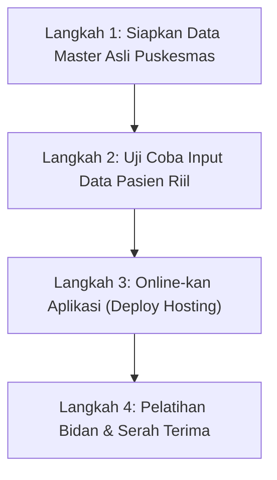

# 📋 Catatan Progres & Panduan Tindakan (My Action Plan)
**Sistem Pengingat ANC Ibu Hamil (Posyandu Kuncir)**  
*Terakhir Diperbarui: 18 Agustus 2026*

---

## 📌 1. Rangkuman Progres (Sudah Sampai Mana Kita?)

Status sistem saat ini: **KODE & INFRASTRUKTUR INTI SUDAH 100% SIAP & AKTIF SECARA LOKAL.**

| Komponen | Status | Keterangan |
| :--- | :---: | :--- |
| **Database Supabase** | ✅ **Selesai** | Terhubung ke project `anc-reminder-kuncir` (`eelgatcekddwxcofykzs`). Seluruh tabel dan skema database sudah termigrasi. |
| **Backend API (NestJS)** | ✅ **Aktif** | Berjalan di port `3001` (`http://localhost:3001/api/v1/health/ready`). |
| **Frontend Web (Next.js)** | ✅ **Aktif** | Berjalan di port `3000` (`http://localhost:3000`), responsif untuk layar laptop maupun layar HP. |
| **Akses Jaringan HP (Hotspot)** | ✅ **Aktif** | Berhasil diakses dari HP via IP lokal: `http://10.155.10.200:3000`. |
| **Notifikasi Firebase (FCM)** | ✅ **Selesai** | Kredensial Firebase (`posyandu-kuncir`) terpasang di `.env`, token Google OAuth2 terverifikasi, dan sinkronisasi Android (`npx cap sync android`) selesai. |
| **WhatsApp Fallback (`wa.me`)** | ✅ **Selesai** | Siap mengirimkan pesan WhatsApp otomatis jika ibu hamil belum memasang aplikasi APK di HP. |

---

## 🚀 2. Daftar Tindakan yang Harus Dilakukan Selanjutnya (Langkah Demi Langkah)

Ikuti 4 langkah terstruktur berikut untuk menyelesaikan proyek ini hingga siap dipakai resmi oleh Puskesmas:

---

### 🔹 Langkah 1: Siapkan Data Master Asli Puskesmas
Saat ini database masih berisi data simulasi (*dummy* seperti Desa Kuncir, Posyandu Mawar, Siti Aminah). Sebelum diserahkan, siapkan data riil:

1. **Minta data wilayah kerja dari Puskesmas**:
   - Daftar nama Desa / Kelurahan binaan Puskesmas.
   - Daftar nama Posyandu di setiap desa.
   - Daftar nama Bidan Desa beserta nomor WhatsApp aktif yang bertugas.
2. **Buat Akun Petugas & Bidan**:
   - Buka portal Staff di [http://localhost:3000/staff/login](http://localhost:3000/staff/login) (login sebagai `petugas.kuncir`).
   - Masuk ke menu **Organisasi / Pengguna** untuk mendaftarkan akun Bidan Desa sesuai wilayah desanya masing-masing.

---

### 🔹 Langkah 2: Uji Coba Input Data Pasien Riil (Simulasi 1-3 Ibu Hamil)
1. **Daftarkan Ibu Hamil Baru**:
   - Masuk ke menu **Pendaftaran Pasien**.
   - Masukkan nama ibu hamil, NIK, tanggal HPHT asli, dan pilih Posyandu serta Bidan pembina.
   - Sistem akan otomatis menghitung perkiraan lahir (HPL) serta jadwal kunjungan ANC K1 s/d K8 sesuai standar Kemenkes RI 2020.
2. **Salin Kode Akses Pasien**:
   - Sistem akan menerbitkan kode akses (contoh: `ANC-XXXX-XXXX-XXXX-XXXX`).
3. **Cek Portal Ibu Hamil di HP**:
   - Di HP Anda, buka `http://10.155.10.200:3000/mother/login`.
   - Masukkan Nama dan Kode Akses tadi.
   - Pastikan tanggal linimasa kehamilan tampil dengan benar di layar HP.

---

### 🔹 Langkah 3: Online-kan Aplikasi ke Hosting / Domain Publik
Agar Bidan di Puskesmas dan Ibu Hamil di rumah bisa membuka aplikasi kapan saja tanpa perlu laptop Anda menyala:

1. **Sewa Domain & Server Hosting / VPS**:
   - Domain contoh: `posyandukuncir.id` atau subdomain dari Dinas Kesehatan.
   - Server Node.js (bisa menggunakan Hostinger VPS / Cloudflare / Railway / Vercel).
2. **Deploy Backend API & Frontend Web**:
   - Panduan konfigurasi server produksi lengkap ada di file `docs/DEPLOYMENT_PROVISIONING.md` dan `human.md`.
   - Salin variabel environment `.env` ke dashboard hosting Anda.

---

### 🔹 Langkah 4: Pelatihan Bidan & Serah Terima ke Puskesmas
1. **Sosialisasi ke Bidan & Petugas**:
   - Tunjukkan cara login ke portal staff.
   - Tunjukkan cara input ibu hamil baru saat posyandu bulanan.
   - Tunjukkan cara konfirmasi kehadiran saat ibu hamil datang kontrol (K1 s/d K8).
2. **Uji Pengingat WhatsApp**:
   - Tunjukkan tab antrean WhatsApp (`wa.me`) di mana Bidan cukup menekan satu tombol untuk mengirim pengingat ke ibu hamil yang mendekati jadwal kontrol.

---

## 🔑 3. Kredensial Login Pengujian Cepat (Saat Ini)

- **Admin Puskesmas**:
  - URL: [http://localhost:3000/staff/login](http://localhost:3000/staff/login) (atau `http://10.155.10.200:3000/staff/login`)
  - Username: `petugas.kuncir`
  - Password: `PosyanduKuncir2026!`
- **Bidan Desa**:
  - URL: [http://localhost:3000/staff/login](http://localhost:3000/staff/login)
  - Username: `bidan.kuncir`
  - Password: `PosyanduKuncir2026!`
- **Ibu Hamil (Demo)**:
  - URL: [http://localhost:3000/mother/login](http://localhost:3000/mother/login)
  - Nama: `Siti Aminah`
  - Kode Akses: `ANC-2345-6789-ABCD-EFGH`
